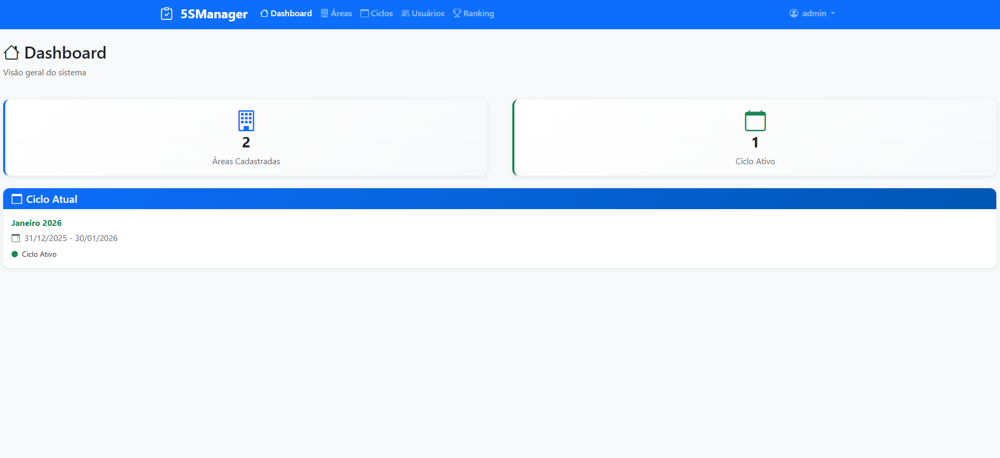
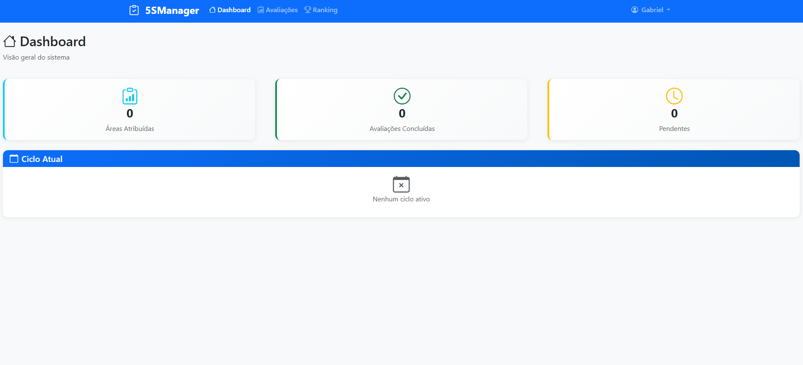
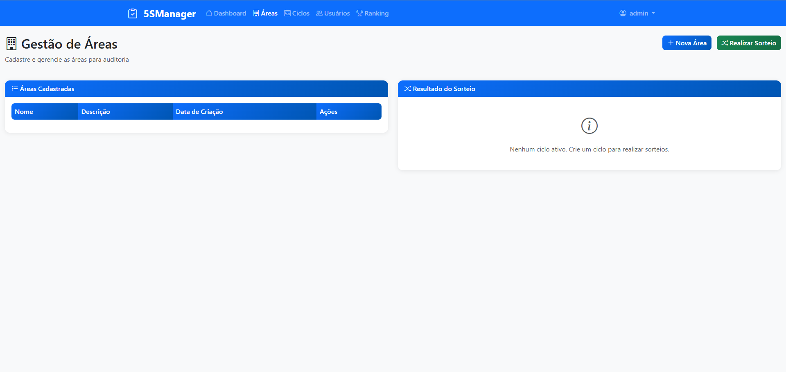
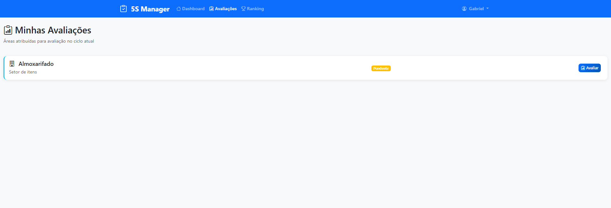
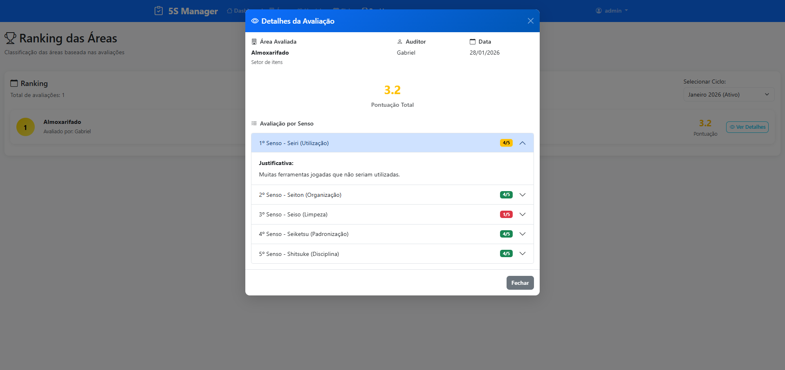

# 5SManager - Sistema de Gestão 5S

Sistema completo para gestão e auditoria do programa 5S, desenvolvido com Flask (Python), Bootstrap e SQLite.

## 📋 Funcionalidades

### Para Administradores
- **Gestão de Áreas**: Cadastrar, editar e excluir áreas para auditoria
- **Sorteio Automático**: Distribuir áreas entre auditores de forma justa e aleatória
- **Gestão de Ciclos**: Criar e gerenciar ciclos mensais de auditoria
- **Visualização de Rankings**: Acompanhar classificação das áreas
- **Dashboard Administrativo**: Visão geral do sistema

### Para Auditores
- **Avaliações 5S**: Registrar notas de 1 a 5 para os 5 sensos com justificativas obrigatórias
- **Histórico de Avaliações**: Visualizar avaliações anteriores das áreas
- **Minhas Atribuições**: Ver áreas atribuídas no ciclo atual
- **Dashboard do Auditor**: Acompanhar progresso das avaliações

### Funcionalidades Gerais
- **Autenticação Segura**: Login com controle de acesso por tipo de usuário
- **Interface Responsiva**: Funciona perfeitamente em desktop e mobile
- **Ranking Mensal**: Classificação automática das áreas baseada nas avaliações
- **Controle de Ciclos**: Sistema impede novo ciclo antes do encerramento do anterior

## 🏗️ Arquitetura

### Backend (Flask)
- **Framework**: Flask 3.1.1
- **Banco de Dados**: SQLite
- **Autenticação**: Flask-Login + Flask-Bcrypt
- **ORM**: SQLAlchemy

### Frontend
- **Framework CSS**: Bootstrap 5.3.2
- **Icons**: Bootstrap Icons
- **JavaScript**: Vanilla JS (ES6+)
- **Design**: Responsivo e moderno

## 📷 Demonstração

### Dashboard Administrativo


### Dashboard do Auditor


### Cadastro e Sorteio de Áreas


### Avaliações


### Ranking / Resultado



### Estrutura do Projeto
```
5smanager/
├── src/
│   ├── models/
│   │   └── user.py          # Modelos de dados (User, Area, Evaluation, Cycle, etc.)
│   ├── routes/
│   │   ├── auth.py          # Rotas de autenticação
│   │   ├── areas.py         # Rotas de gestão de áreas
│   │   ├── cycles.py        # Rotas de gestão de ciclos
│   │   ├── evaluations.py   # Rotas de avaliações
│   │   └── user.py          # Rotas de usuários
│   ├── static/
│   │   ├── index.html       # Interface principal
│   │   ├── app.js           # JavaScript da aplicação
│   │   └── style.css        # Estilos personalizados
│   ├── database/
│   │   └── app.db           # Banco de dados SQLite
│   └── main.py              # Arquivo principal da aplicação
├── requirements.txt         # Dependências do projeto
└── README.md               # Documentação
```

## 🚀 Instalação e Execução

### Pré-requisitos
- Python 3.11+
- pip (gerenciador de pacotes Python)

### Passo a passo

1. **Clone ou baixe o projeto**
   ```bash
   # Se usando git
   git clone <url-do-repositorio>
   cd 5smanager
   ```

2. **Ative o ambiente virtual**
   ```bash
   source venv/bin/activate
   ```

3. **Instale as dependências**
   ```bash
   pip install -r requirements.txt
   ```

4. **Execute a aplicação**
   ```bash
   python src/main.py
   ```

5. **Acesse o sistema**
   - Abra o navegador e acesse: `http://localhost:5000`
   - Login padrão do administrador:
     - Usuário: `admin`
     - Senha: `admin123`

## 👥 Usuários Padrão

### Administrador
- **Usuário**: admin
- **Senha**: admin123
- **Email**: admin@5smanager.com

### Como criar novos usuários
1. Faça login como administrador
2. Use a API `/api/auth/register` ou
3. Crie via interface (funcionalidade pode ser adicionada)

## 📊 Como Usar o Sistema

### 1. Configuração Inicial (Admin)
1. Faça login como administrador
2. Vá para "Áreas" e cadastre as áreas que serão auditadas
3. Vá para "Ciclos" e crie um novo ciclo mensal
4. Realize o sorteio de áreas clicando em "Realizar Sorteio"

### 2. Avaliações (Auditor)
1. Faça login como auditor
2. Vá para "Avaliações" para ver suas áreas atribuídas
3. Clique em "Avaliar" na área desejada
4. Preencha as notas (1-5) e justificativas para cada um dos 5 sensos:
   - **Seiri (Utilização)**: Separar o necessário do desnecessário
   - **Seiton (Organização)**: Um lugar para cada coisa
   - **Seiso (Limpeza)**: Manter limpo e identificar problemas
   - **Seiketsu (Padronização)**: Manter os padrões estabelecidos
   - **Shitsuke (Disciplina)**: Seguir os procedimentos estabelecidos

### 3. Acompanhamento
- **Dashboard**: Visão geral do progresso
- **Ranking**: Classificação das áreas por pontuação
- **Histórico**: Comparação com avaliações anteriores

## 🔧 APIs Disponíveis

### Autenticação
- `POST /api/auth/login` - Fazer login
- `POST /api/auth/logout` - Fazer logout
- `POST /api/auth/register` - Registrar usuário
- `GET /api/auth/check-auth` - Verificar autenticação

### Áreas
- `GET /api/areas/` - Listar áreas
- `POST /api/areas/` - Criar área
- `PUT /api/areas/{id}` - Atualizar área
- `DELETE /api/areas/{id}` - Excluir área
- `POST /api/areas/draw` - Realizar sorteio

### Ciclos
- `GET /api/cycles/` - Listar ciclos
- `GET /api/cycles/active` - Ciclo ativo
- `POST /api/cycles/create-monthly` - Criar ciclo mensal
- `GET /api/cycles/{id}/ranking` - Ranking do ciclo

### Avaliações
- `GET /api/evaluations/` - Listar avaliações
- `POST /api/evaluations/` - Criar avaliação
- `GET /api/evaluations/my-assignments` - Minhas atribuições


## 🔒 Segurança

- **Autenticação**: Sistema de login seguro com hash de senhas
- **Autorização**: Controle de acesso baseado em tipos de usuário
- **Validação**: Validação de dados no frontend e backend
- **Sanitização**: Prevenção contra ataques comuns

## 📱 Responsividade

O sistema foi desenvolvido com foco em responsividade:
- **Desktop**: Interface completa com todas as funcionalidades
- **Tablet**: Layout adaptado para telas médias
- **Mobile**: Interface otimizada para smartphones

## 🚀 Próximos Passos

Funcionalidades que podem ser adicionadas:
- Relatórios em PDF
- Gráficos de evolução
- Notificações por email
- Integração com sistemas externos
- Backup automático
- Logs de auditoria


## 📄 Licença

Este projeto foi desenvolvido como sistema personalizado para gestão 5S.

---

**5SManager** - Automatize sorteios, registre avaliações e acompanhe rankings mensais! 🏆

